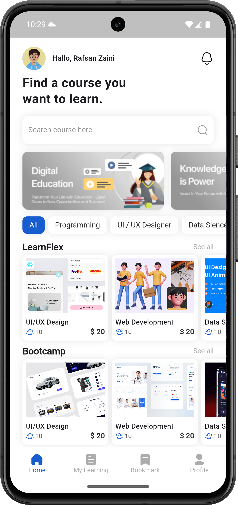
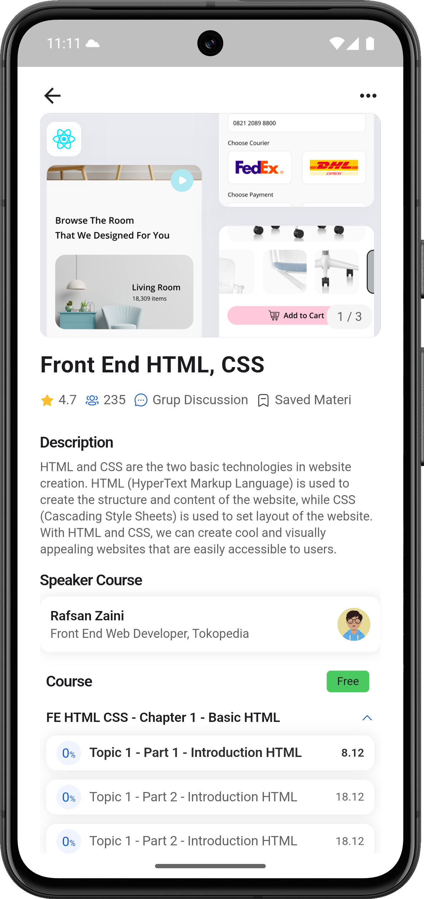
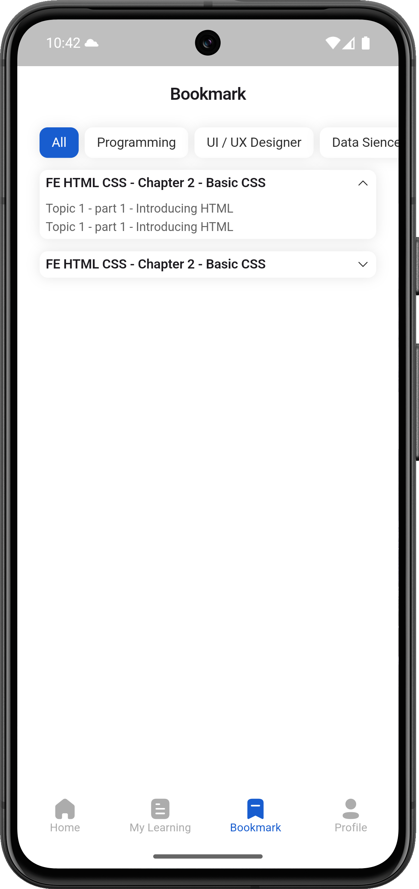
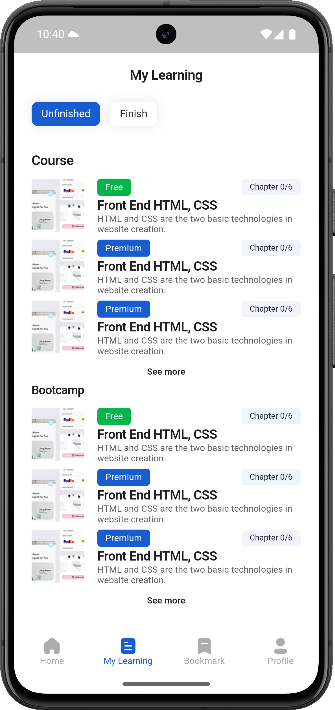
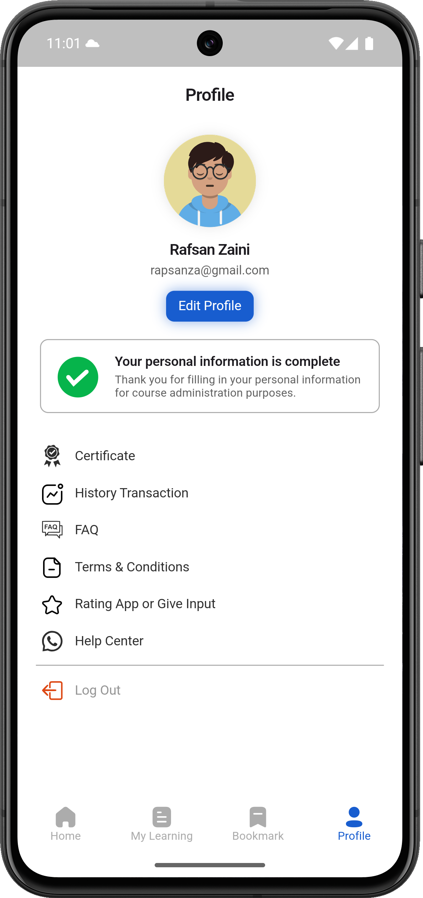

# 📱 Flutter UI Kit


A modern and responsive UI kit for a course learning application built using Flutter.  
This project includes fully designed mobile screens suitable for online learning platforms, created with clean and reusable code.

---

## ✨ Highlights

- Flutter-based mobile UI kit  
- Includes 17+ screens and growing  
- Beautiful and minimal layout  
- Organized folder structure  
- Reusable widgets  
- Ready to integrate with any backend


---

## 📸 Screenshots

<p float="left">
  
  
  
  
  
</p>


---

## 📁 Folder Structure

lib/

├── core/

├── controllers/

├── screens/

├── widgets/

└── main.dart

---

## 🛠️ Getting Started

```bash
git clone https://github.com/your-username/flutter-ui-kit.git
cd mentora-ui
flutter pub get
flutter run
```


---

##  🎨 Design Source

Original Figma Design: [LearnConnect UI Kit](https://ui8.net/fahmi-haecal/products/learnconnect---mobile-app-ui-kit)  
Designed by: [Fahmi Haecal](https://ui8.net/fahmi-haecal)
